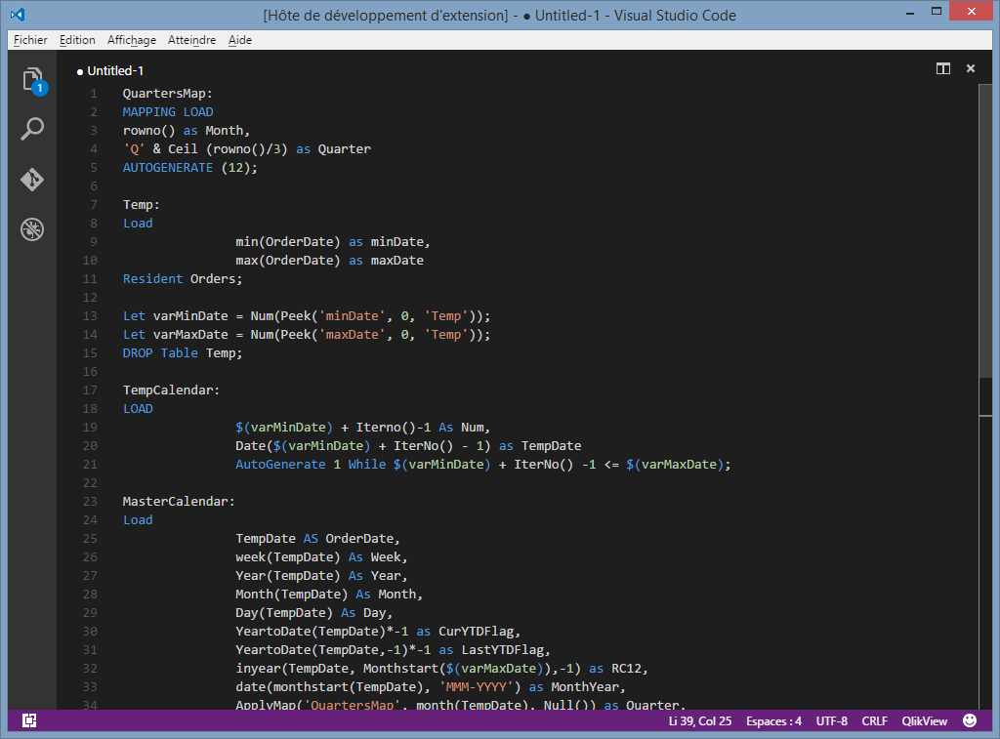

# Qlik for Visual Studio Code

This extension adds support for Qlik scripting to VS Code.

## Colorization 

(imported from [a syntax for Sublime Text](https://github.com/kmpm/sublime-qvs))

## Contributors
Thanks a lot to this project's awesome contributors for their help!

* Matt Fryer (@MattFryer)
* Stefan Stoichev (@countnazgul)